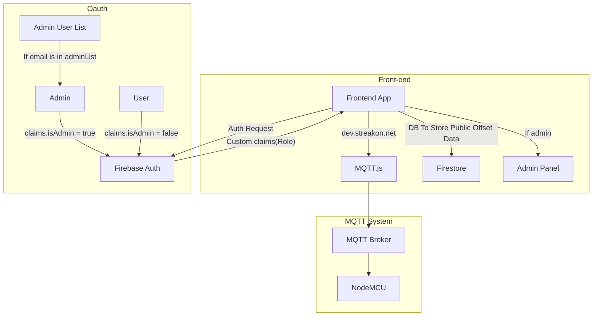

# 🏗️ System Architecture Diagram of Working Principles

This system is structured into **three main subsystems**, each with its role in the MQTT-based real-time frontend connected to Firebase authentication and Firestore.

---

## 🔐 1. OAuth & Authentication System (subgraph `s3`)

This part of the system manages user authentication and admin recognition using **Firebase Auth** with **custom claims**.

- **RegularUser** → Authenticates with `FirebaseAuth`  
  ↳ Receives: `claims.isAdmin = false`
  
- **AdminUser** → Authenticates with `FirebaseAuth`  
  ↳ Receives: `claims.isAdmin = true`

- **Admin User List (`n1`)** → A pre-defined list used to check if an email belongs to an admin  
  ↳ If matched → Treated as an `AdminUser`

**→ FirebaseAuth then attaches custom claims to the JWT token**, which the frontend can use to determine role-based access (like admin panel visibility).

---

## 💻 2. Frontend & Database System (subgraph `s2`)

Handles the frontend interface, communication with MQTT, and Firestore DB access.

- **WebApp** = Main frontend interface  
  - Sends **auth requests** to `FirebaseAuth`
  - Reads/writes to **Firestore** (for public offset data)
  - Connects via `MQTT.js` to the broker at `dev.streakon.net`
  - If user is an admin (based on custom claims), shows the **Admin Panel**

---

## 📡 3. MQTT System (subgraph `s1`)

This handles real-time data communication between the frontend and IoT device.

- **MQTTClient (`MQTT.js`)** → Subscribes via WebSockets  
- **MQTT Broker** → Receives and routes MQTT messages  
- **IoT Device (NodeMCU)** → Publishes sensor data via the broker

---

### 🧠 Summary Logic

1. **User logs in via Firebase Auth**  
2. Firebase returns a token with **custom claims**
3. WebApp uses those claims to:
   - Show/hide the admin panel
   - Connect to MQTT and Firestore
4. **MQTTClient** communicates in real time with the **NodeMCU** via the broker
5. **Firestore** stores public offset data as needed
6. 
