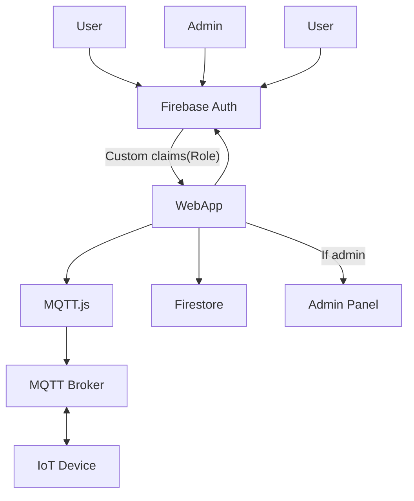

# Architecture Diagram of Working Principles

```mermaid
graph TD

FirebaseAuth["Frontend App"]
User --> FirebaseAuth["Firebase Auth"]

WebApp --> MQTTClient["MQTT.js"]
MQTTClient --> Broker["MQTT Broker"]
Broker <--> IoT["IoT Device"]
WebApp --> FirebaseAuth
WebApp --> Firestore["Firestore"]

AdminUser["Admin"] --> FirebaseAuth
RegularUser["User"] --> FirebaseAuth

FirebaseAuth -->|"Custom claims(Role)"| WebApp
WebApp -->|If admin| AdminPanel["Admin Panel"]
```
